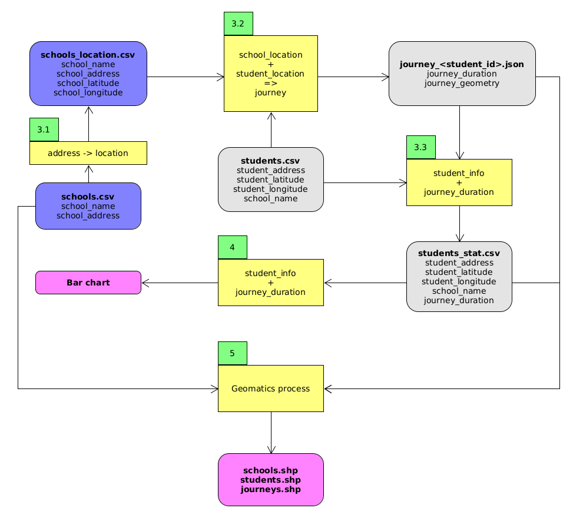

# Development Project

## Objectives

1. Write commented Python code;
2. Manipulate data with and without pandas;
3. Communicate with an API;

## Data

There are 2 data :
* a list of schools (name and address) ;
* a list of student (address, location and school name).

The main aims of the project is to make statistics about the time that students need to go to school.

We do not know the time the students need. But we know there address, so we can use an external tool (call an API) to get the information.

Then we can make statistics.

The optional part of the project is to write Shapefile to visualize the manipulated datas.

## Project statement

1. Open the data and look at it.

2. Using the Navitia API:
    1.  make a function that returns the location of an address ;
    2.  make a function that returns the best journey between two locations.

3. Calculate data (using the two precedent functions):
    1. create a `schools_location.csv` file with the location of each school (add both `longitude` and `latitude` columns) ;
    2. create, for each student, a JSON file (`journey_<student_id>.json`) with the best journey between his home and his school (put them in a subfolder `journeys`) ;
    3. create a `students_stat.csv` file with the **duration** (in seconds) of the journey of each student between his home and his school.

4. Make statistics:
    1. Open the `students_stat.csv` file with pandas ;
    2. Make a global Bar chart of the duration ;
    3. Make a Bar chart of the duration for each school.

5. Make Shapefile data: (optional)
    1. create a `schools.shp` file with one **point** for each school (**location** and `name`) ;
    2. create a `students.shp` file with one **point** for each student (**location**, `address` and `school`) ;
    3. create a `journeys.shp` file with, one **line** for each journey (**line**, `student_id`).

## Help!

### Starting

Create a folder `project-2`, put both [students.csv](students.csv) and [school.csv](schools.csv) files inside.

Open Jupyter Notebook or Spyder and create a new Python file.

You are ready to start!

### Navitia API

Look at the [Navitia Exercice](../navitia/README.md).

### Calculate location and journey

#### Location

Iterate throw the `schools.csv` file with pandas and use the function that returns the location of an address to calculate the address.

You can then save a new dataframe with tow more columns (longitude and latitude) in a `schools_location.csv` file.

#### Journey

Iterate throw the `students.csv` file with pandas.

If the file corresponding to the user does not exist, calculate the journey with the function that returns the best journey between two locations and save it in a file.

#### Duration

Iterate throw the `students.csv` file with pandas and open the corresponding json file to get the duration of the journey.

You can then save a new dataframe with one more column (duration) in a `students_stat.csv` file.

### Statistics

Look at the [Pandas Exercices](../exercises/exercise_07.md).

### Shapefile

Look at the [PyShp library](https://github.com/GeospatialPython/pyshp#pyshp) to find how to write Shapefile from Python.

## Send me

Send me a Python script: Jupyter Notebook (`.ipynb`) or standard Python file (`.py`).
